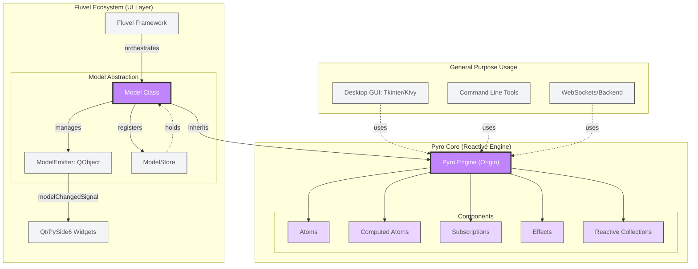

<picture>
    <source media="(prefers-color-scheme: dark)" srcset="https://raw.githubusercontent.com/fluvel-project/fluvel/main/assets/brands/banner-pyro-dark.svg">
    
</picture>

# The Future of Pyro

At the moment, `Pyro` (Pyro Yields Reactive Objects) is the reactive heartbeat of the Fluvel ecosystem. While it currently serves as the state
management engine for Fluvel, it is architected as an **agnostic**, **zero-dependency** and **pure-Python core**.

This manifest serves as a **technical contract**. it outlines the upcoming API and the evolutionary path of the Pyro Ecosystem, ensuring a future-proof architecture for developers.

## Philosophy
1. **Transparency**: Data should behave like native Python objects. No getters, no setters, just atoms. *If it looks like a Python object and feels like a Python object, it should behave like a Pyro object.*
2. **Agnosticism**: Pyro doesn't care if you are building a UI, a game, or a backend service.
3. **Atomic Precision**: Update only what changed, notify only who is listening, no CPU cycle should be wasted on a component that has not changed.

## The Technical Contract (.pyi)

We are launching with a **Pure Core**: the essential reactivity engine. This ensures a solid foundation and flawless dependency tracking. The following manifest describes the utilities that will be integrated into the **official `Pyro` repository** soon.

```python
"""
This manifest serves as a technical contract for the evolution of Pyro.
Upcoming features are designed to enhance DX (Developer Experience)
without compromising the core's performance.
"""

class Origin:
    # Already implemented in actual version
    def sync(self) -> Self: ...
    def update(self, data: dict[str, Any] = None, **kwargs) -> None: ...
    def to_dict(self) -> dict[str, Any]: ...
    def toggle(self, atom: str) -> None: ...
    def reset(self, *atoms: str) -> None: ...
    def reset_all(self) -> None: ...
    def __repr__(self) -> str: ...
    @contextmanager
    def batch(self) -> Generator[None, None, None]: ...
    # Hooks
    def __awake__(self) -> None: ...
    def __post_init__(self) -> None: ...

    # Implementations for the next version
    # State Capture
    def capture(self, *atoms: str) -> Dict[str, Any]: ...
    def snapshot(self) -> 'Snapshot': ...
    def clone(self, new_alias: str) -> 'Origin': ...
    def track(self, limit: int = 20) -> 'Tracker': ...

    # Atomic Mutations
    def set(self, **kv_atoms) -> None: ...
    def increment(self, atom: str, amount: int = 1) -> None: ...
    def decrement(self, atom: str, amount: int = 1) -> None: ...

    # Action Factories (Functional Helpers that returns functools.partial())
    def as_set(self, **kv_atoms) -> Callable[[], None]: ...
    def as_increment(self, atom: str, amount: int = 1) -> Callable[[], None]: ...
    def as_decrement(self, atom: str, amount: int = 1) -> Callable[[], None]: ...
    def as_toggle(self, atom: str) -> Callable[[], None]: ...
    def as_reset(self, *atoms: str) -> Callable[[], None]: ...
    def as_reset_all(self) -> Callable[[], None]: ...
    def as_update(self, data: Dict[str, Any] = None, **kwargs) -> Callable[[], None]: ...

class Snapshot:
    __slots__ = ["_model_ref", "data", "timestamp"]
    def restore(self) -> bool: ...
    def diff(self) -> Dict[str, Dict[str, Any]]: ...
    def __repr__(self) -> str: ...

@dataclass(slots=True)
class Tracker:
    def commit(self) -> None: ...
    def undo(self) -> None: ...
    def redo(self) -> None: ...
    def jump_to(self, index: int) -> None: ...
    def as_undo(self) -> Callable[[], None]: ...
    def as_redo(self) -> Callable[[], None]: ...
    @property
    def can_undo(self) -> bool: ...
    @property
    def can_redo(self) -> bool: ...
```

## The Standalone Vision
`Pyro` is destined to be decoupled from `Fluvel` to live as a standalone library.
* **Zero Dependencies**: It will only ever require a modern Python interpreter (3.11+).
* **Interoperability**: Ready to be used with PySide, Tkinter, Kivy, or even non-GUI projects.

### Uses of Pyro




## Author's Note

**On the First Official Version**: Most of the features mentioned in this manifest were already architected and tested in private iterations of `Pyro`. I made the conscious decision to exclude them from the initial public release to keep the core **minimalist, readable, pure** and above all to ensure that the core engine is tested before adding the utilities.

What follows in the next versions are optimization layers: conditional logic, advanced validations, and specialized data structures designed to steer the Reactive System toward its most efficient behavior without bloating the foundation.

## Future Engineering & Roadmap

The following implementations are scheduled for upcoming versions. These represetn the transition from a 'minimalist core' to an 'optimized reactive engine'.

### Performance & Optimization
* **Computed Caching (Ready for Release)**: Implementation of a caching system for computed properties to eliminate redundant calculations triggered by the descriptor protocol (`__get__`).
* **Asynchronous Subscriptions**: Moving beyond synchronous execution. Future iterations will support executing `@reaction `methods in separate threads or dedicated asynchronous contexts, preventing Main thread blocking.

### Dynamic Dependency Tracking
* Current State: Pyro uses a cumulative graph (once an atom is read, it remains a trigger).
* Evolution: Implementation of a mechanism to rebuild the `_listeners` set at runtime. This will allow the graph to adapt if a computed property changes its internal logic branches, ensuring notifications only fire when strictly necessary.
* Note: This is balanced against the overhead of constant graph rebuilding.

### Scalability
* **Deep Reactivity**: Extending tracking to nested structures (lists, dicts) without losing the "Native Python" feel.
* **Model Inter-connectivity**: Establishing official patterns for reactive communication between different `Origin` instances.