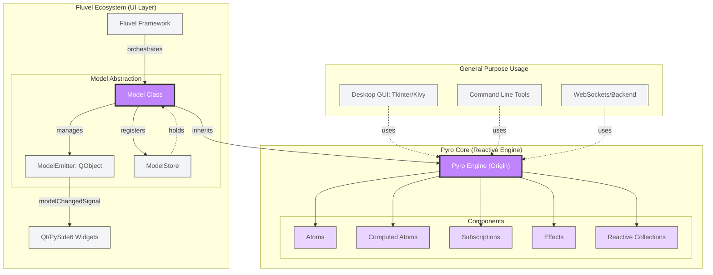

# 5. Reactivity and Modeling (Pyro)

<picture>
    <source media="(prefers-color-scheme: dark)" srcset="../../assets/brands/banner-pyro-dark.svg">
    
</picture>

Finally, to complete the power of `Fluvel`, we find `Pyro` (Pyro Yields Reactive Objects). It is important to understand that Pyro is not just a Fluvel module, but an **agnostic and autonomous reactive engine** born from the framework's need for a system that allows linking reactive models to the UI in a simple way.

>[!NOTE]
> While `Pyro` can work in any Python environment (CLI, Web, other Frameworks), `Fluvel` builds an underlying infrastructure specifically designed to couple this engine to the **PySide6** system. You can read its [Technical Contract and Future Vision here](pyro/MANIFEST.pyro.md).

**What are reactive models?**

A reactive model is an intelligent object in which its "atoms"—that is, its internal variables—are capable of reacting and propagating changes autonomously.

In `Fluvel`, a reactive model is built just like a `@dataclass`, defining variables with their type annotations in the class body. The `Pyro` engine takes care of automatically generating the `__init__` methods to initialize them.

```python
from fluvel import Model # This class is Pyro's link to the Framework
from fluvel import computed # This decorator is for creating atoms that depend on others

class User(Model):
    name: str # Type annotations are important
    age: int = 0 # You can also define a default value
    logged: bool = False

    @computed
    def status(self) -> str:
        return f"User: {self.name} | Logged: {self.logged}"

user = User(ref="um", name="John Doe", age=31) # We will see the meaning of 'ref' later

print(user.status) # Output: 'User: John Doe | Logged: False'

user.name = "New Name" # The status updates
print(user.status) # Output: 'User: New Name | Logged: False'

user.logged = True # The status updates again
print(user.status) # Output: 'User: New Name | Logged: True'

user.logged = True # Nothing updates since the actual value didn't change
```

> [!TIP]
> If an atom in your model starts with an initial value of 0 for numbers, an empty string for `str`, or empty collections, it is not necessary to set an initial value since `Pyro` does it for us by taking the default value of the defined type.
> ```python
> class Person(Model):
>   name: str # default ''
>   age: int # default 0
>   hobbies: list[str] # default []
>   # etc...
> ```

As you can see, the way reactivity works is not complicated to understand: when one of the dependencies of a `@computed` atom changes, the computed atom changes as well.

It is also important to note that the reactive object is treated as if it were a normal Python object; this ease of use is thanks to the transparency of `Pyro`, which uses native language syntax to achieve its goals.

## 5.1 Pyro's Bridge to PySide6
---

For a pure Python engine to control a Qt interface, Fluvel implements an abstraction layer composed of several fundamental pillars:
* `Model` & `ModelEmitter`: Each model inherits from `pyro.Origin` but internally adds a `ModelEmitter` (a real `QObject`) that allows them to emit internal changes from the Pyro model to native Qt widgets.
* `ModelStore`: Serves as a global registry for each instance via the `ref` (reference). This process happens automatically when instantiating a `Model`.
* `StateManager`: It is the intermediary between our widgets and the model, allowing connections to be configured via strings. For example, the syntax `v.Label(bind="text:@um.name")` means we want to bind the `text` property of the label to the `name` attribute of the model `um` (which would be the model's `ref`).
* `Formatter`: Acts as a transformation pipeline. It allows data to travel from the model to the view passing through filters (`upper`, `.2f`) and text templates (placed in the `bind` argument) without cluttering the business logic.

With this infrastructure, the user interface is simply a "mirror" that "plugs" into the data model to visualize or modify it.

The following diagram shows that `Pyro` can be coupled to any ecosystem.



## 5.2 Atoms, Computed, Reactions, and Effects
---

`Pyro` doesn't just store information; it allows your models to "think" and configure their internal behavior by themselves. To achieve this, the engine offers four main tools that bring our objects to life.

**1. Atoms**

These are the minimum units of information in your model. Imagine them as the basic bricks: your name, your age, or whether a session is started. In `Pyro`, any attribute you define with a type annotation automatically becomes an atom capable of notifying others when its value changes.

> [!NOTE]
> When defining your variables, those that start with an `_` (underscore) will not be processed by `Pyro` and will be treated as normal Python variables.

**2. Computed Atoms (`@computed`)**

Used when you want to define an atom whose value depends on other base atoms. They are like "smart calculations": if you have a `price` atom and a `quantity` atom, it is logical to have a `total` computed atom. The amazing thing is that you don't have to tell Pyro what to watch; the engine "sees" which atoms you use in the calculation and subscribes to them automatically.

**3. Reactions (`@reaction`)**

Unlike computed atoms, reactions do not return a value; instead, they execute an **action** (a side effect). They are ideal for saving data to a file or printing logs. Here you have full control: you explicitly tell Pyro which atoms it should watch to trigger the function.

**4. Conditional Effects (`@effect`)**

These are elite triggers. They only execute when a specific rule you define is met. To build these rules, Pyro uses an integrated **DSL (Domain Specific Language)** that allows expressing complex logic declaratively.

For example, you could have an effect that only activates when the age is greater than 18, or even compose more complex rules. You could say they are like internal events that happen when a condition is met.

```python
@effect(when=If.AtLeast("age", 18))
def unlock_pro_features(self):
    # Only triggers when the legal age rule is met
    print("PRO features unlocked!")
```

> [!NOTE]
> The `If` class is part of the Pyro rules engine. You can consult the [Complete Guide to Rules and Validations (If/Is/To/Var)](pyro/rules.md) to see all available predicates (comparisons, ranges, data types, and compound logic).

**Reactive Collections**

If you declare a `list`, `dict`, or `set`, Pyro wraps them in special structures. An `.append()` on a list will be detected as a change and the interface will be notified, without you having to reassign the variable.

**Example of a Model with a "Life of Its Own"**

```python
from fluvel import Model, computed, reaction, effect
from fluvel.reactive import If

class SmartUser(Model):
    name: str = "Guest"
    age: int = 0
    tags: list[str] # Automatically becomes a reactive list

    @computed
    def status(self) -> str:
        # Updates only when 'name' or 'age' changes
        return f"{self.name} ({self.age} years old)"

    @reaction("name")
    def on_name_change(self):
        # Reacts specifically when the name changes
        print(f"User is now called: {self.name}")

    @effect(when=If.Greater("age", 18))
    def unlock_pro_features(self):
        # Only triggers when the legal age rule is met
        print("PRO features unlocked!")

# Instantiate and activate the engine
user = SmartUser(ref="u1", name="John Doe").sync()

user.age = 19
# 1. 'status' is recalculated.
# 2. 'unlock_pro_features' detects the rule is met and activates.

user.tags.append("developer") # Pyro automatically notifies the change in the list
```

> [!TIP]
> **The power of `.sync()`**: Always call this method at the end of your model creation. This gives Pyro an initial "push" to read all your computed atoms and effects for the first time and prepare the internal connection map.

> [!IMPORTANT]
> Keep in mind that by default **all** methods decorated with `@reaction` execute at startup. If you don't want this behavior, you can add the `lazy=True` argument to the decorator.

## 5.3 The Binding Syntax (`Bind`)
---

When instantiating a model, the `ref` argument is mandatory and must be passed explicitly as a keyword (`ref="my_model"`).

This reference acts as the **persistent identity** of the object within `Fluvel`. Its importance is vital for **Hot-Reload** and the `Binding System`: if you modify your business logic code while the application is running, the framework detects the change and replaces the old instance with the new one transparently.

Thanks to this "metamorphosis" mechanism, the **new logic** (methods, computed atoms, reactions, or effects) is injected over the **live data** you already had, avoiding manual restarts and maintaining the current state of your interface.

**How do I connect models to my interface?**

We use the `bind` argument in widgets, following this syntax:

```powershell
[property]:[signal]:@[ref].[attribute] %.[filter] '[template]'
```
* **property**: Widget property (e.g., `text`, `enabled`).
* **signal**: Widget signal for bidirectional binding (e.g., `textChanged`, `valueChanged`).
* **ref**: The model reference.
* **attribute**: The model's atom or computed attribute.
* **filter**: (Optional) Data transformation (e.g., `upper`, `.2f`).
* **template**: (Optional) Text template (e.g., `'Price: $%v'`).

## 5.4 Binding Levels
---

When binding a widget to a model, the combination of entities will determine the level of reactivity.

There are **4 Levels** to configure this `Model - Widget` relationship:

**Level 1: Automatic Binding (Minimum)**

Fluvel deduces the default property and signal for the widget.

* **Syntax**: `@ref.attribute`
* **Example**: `@test.username`
* **Fluvel's Voice**: "StateManager, connect this widget to `username` from the `test` model. Use its standard property and signal so they update each other."

**Level 2: Explicit One-Way Binding (`State` → `Widget`)**

The model updates the widget, but the widget does not touch the model.
* **Syntax**: `property:@ref.attribute`
* **Example**: `text:@test.password`
* **Fluvel's Voice**: "Put the value of `password` into the `text` property. But ignore what the user does; don't update the state."

**Level 3: Explicit Two-Way Binding (`State` ↔ `Widget`)**

You define exactly which property and signal to use for total synchronization.
* **Syntax**: `property:signal:@ref.attribute`
* **Example**: `value:valueChanged:@global.master_volume`
* **Fluvel's Voice**: "Keep `value` synchronized with `master_volume`. Also, if `valueChanged` triggers, update the model immediately."

**Level 4: Write-Only Binding (`Widget` → `State`)**

An advanced level using the `~` (tilde) prefix to establish a reverse one-way binding, taking the value of a property without letting the state modify it reactively.

* **Syntax**: `~property:signal:@ref.attribute`
* **Example**: `~text:clicked:@test.sport_selected`
* **Fluvel's Voice**: "When `clicked` happens, take the `text` value and save it in `sport_selected`. But if the model changes elsewhere, don't touch the widget."

**Practical Syntax Examples**

```python
# Level 1: Automatic (Label uses 'text', Input uses 'text' and 'textChanged')
v.Label(bind="@um.name")

# Level 2: One-way (Controlling if a button is enabled)
v.Button(text="Submit", bind="enabled:@um.is_adult")

# Level 3: Explicit Bidirectional
v.Slider(bind="value:valueChanged:@global.volume")

# Formatter: Filters and Templates
v.Label(bind="@um.price %.2f 'Final Price: $%v'")
```

## 5.5 Full Example: Reactive Counter

```python
import fluvel as fl

class Counter(fl.Model):
    count: int = 0
    
    def increment(self):
        self.count += 1
    
    def decrement(self):
        self.count -= 1

# Register the model with ref="cm"
cm = Counter(ref="cm")

@fl.route("/test")
class TestPage(fl.Page):
    def build(self):
        with self.Grid() as grid:
            c1, c2, c3 = grid.Columns(3)

            # Level 1: Label updates automatically
            c1.Label(bind="@cm.count % 'Counter: %v'", cspan=2)

            # Buttons invoking model methods
            c1.Button(text="-", on_click=cm.decrement)
            c2.Button(text="+", on_click=cm.increment)
            
            # Level 3: Bidirectional slider connected to the same atom
            c3.Slider(bind="value:valueChanged:@cm.count", rspan=2)
```

> [!TIP]
> Try this: Change the increment method from `self.count += 1` to `self.count += 10` while the app is running. You'll see that the counter doesn't reset to 0, but now it increments by 10.

**Data Flow (Bidirectional)**

```mermaid
sequenceDiagram
    participant Model as Pyro Model (Data)
    participant Bind as Bind Engine
    participant UI as UI Components

    rect rgb(60, 60, 60)
    NOTE over Model, UI: Initial State
    UI->>Bind: Request Data
    Bind->>Model: Read Value
    Model-->>UI: Return Value
    end

    rect rgb(80, 80, 80)
    NOTE over Model, UI: User Interaction
    UI->>Model: User changes value (Input/Slider)
    Model->>Bind: Notify Change (Emit)
    Bind->>UI: Update other linked Widgets
    end
```



> [!NOTE]
> The diagram presented corresponds to `Bidirectional Binding`, where a change in the model updates the UI and vice versa.
>
> For `Unidirectional Binding`, the flow always starts at the Model: when the model changes, it notifies the binding engine, which then updates the UI. The UI does not update the model directly.

## 5.6 Production Utilities
---

`Pyro` includes advanced tools for optimization and persistence:

* **Batch Updates** (`batch`): `Pyro` can handle hundreds of thousands of grouped mutations (Batching) in milliseconds and avoid I/O bottlenecks. It optimizes reactivity by grouping multiple changes into a single interface notification, ideal for heavy processes.

```python
with user.batch():
    user.name = "Alice"
    user.age = 30
    user.email = "alice@example.com"
    # The UI redraws only once upon exiting the block
```

* **Native Serialization**: Converts your models to standard Python dictionaries (`dict`), making it easy to save them to databases or JSON files.

```python
# Export state
data = user.to_dict()

# Method 1: At model instantiation
user = User(ref="um", **data)

# Method 2: Update existing model state
user.update(data)
```