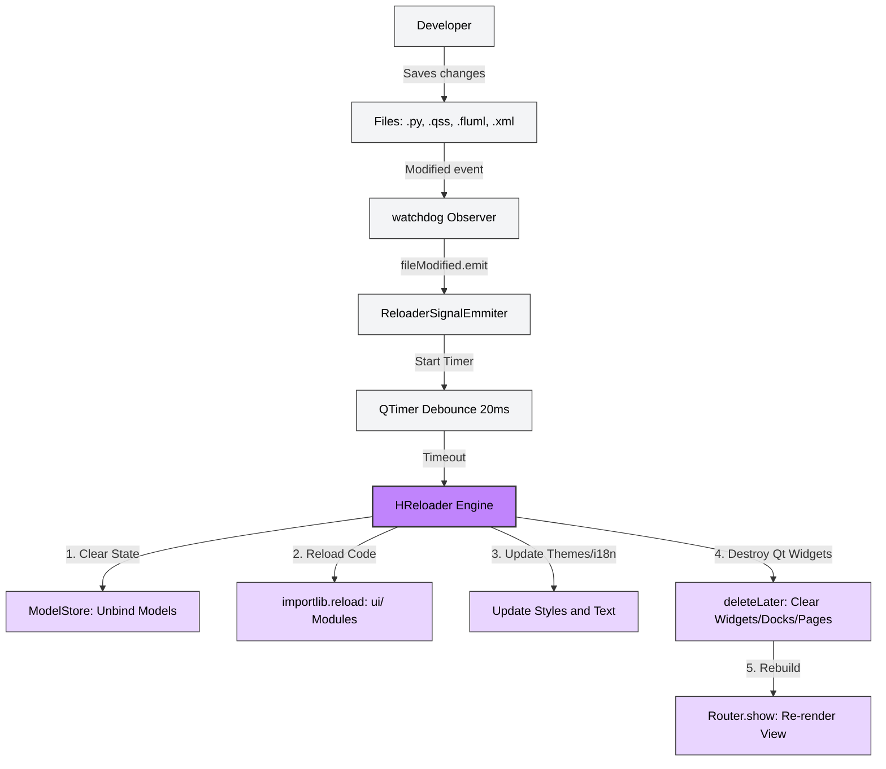

# 2. UI Design

In this section, we will get down to work on creating the Graphical User Interface of the applications using `Fluvel's` declarative syntax.

## 2.1 Design Through Context Handlers

We could say that `Fluvel` revolutionizes interface creation in `PySide6`, as it completely eliminates the need to manually manage Layouts (`QVBoxLayout`, `QHBoxLayout`, `QGridLayout`) and `QWidget` configuration.

Let's take a look at a code block to understand what makes it so unique.

```python
import fluvel as fl

@fl.route("/test")
class TestPage(fl.Page):
    def build(self):

        with self.Vertical() as vbody:
            vbody.Label(text="User Profile")

            with vbody.Horizontal() as h:
                h.Button(text="Save")
                h.Button(text="Cancel")
```

## 2.2 The Library of Widgets and Layouts

As you likely noticed, you don't need to import `FButton` or `FLabel` in every UI file; `Fluvel` powers widgets and layouts through a **unified API**. Thanks to this, each container (Vertical, Horizontal, Grid, etc.) knows exactly which widgets it can create, offering full autocompletion and strong typing.

This allows for a **Clean and Native Syntax**.

```python
from fluvel.tools import icon

with self.Vertical() as v:
    v.Label(text="Title", style="h1 .b")
    v.Input(placeholder="Search...", clear_button=True)

    with v.Horizontal() as h:
        h.Button(text="Accept", on_click=self.save)
        h.IconButton(icon=icon("cancel")) # Icon cancel from Material Design via qtawesome
```

> [!IMPORTANT]
> **Efficiency Comparison**: In standard `PySide6` development, creating a simple form with validation and nested layouts can require between 50 and 80 lines of code just for the visual layout. With `Fluvel's` Context Handlers and `Pyro's` `Reactive Models`, that same result is achieved in less than 15 lines.
>
> This represents a code reduction of more than 70%! Not only is less code written, but the resulting code is drastically easier to read, maintain, and modify. 

### 2.2.1 Main Layouts

So far, we have only used `Vertical` and `Horizontal` Layouts.

```python
# Vertical Layout
with self.Vertical() as v: 
    v.Label(text="Title")
    v.Label(text="This text will be below the title.")

# Horizontal Layout
with self.Horizontal() as h: 
    h.Label(text="Title")
    h.Label(text="This text will be to the right of the title.")
```

As you can see, these layouts are identical in operation and highly intuitive; they simply represent a linear flow (vertical or horizontal) where widgets are stacked. However, there is a more complex and non-linear layout type: The `Grid`.

**The `Grid` Layout:**

In the world of Graphical User Interfaces, an element that manages internal cells in a two-dimensional matrix is extremely useful and powerful, though they often come with a complex or manual configuration API due to the nature of matrices (managing cells via `(x, y)` coordinates).

Unlike other ecosystems, `Fluvel` proposes a different philosophy to maximize the utility of this component declaratively.

In `Fluvel`, the Grid is based on a "channel flow" philosophy. Instead of calculating two-dimensional coordinates, you only need to define how many columns your design requires. Imagine the Grid as a series of parallel tracks where each manages its own vertical flow autonomously. The framework removes the mental burden of coordinates so you can focus on the hierarchy of your interface.

```python
with self.Grid() as grid:
    sidebar, content = grid.Columns(2)

    # The sidebar manages its internal row automatically
    sidebar.Image(source="assets/logo.png", size=60, rspan=2)
    
    # Content can expand or have its own logic
    content.Label(text="Welcome", style="h1")
    content.Label(text="This is the dashboard body.")

    sidebar.Button(text="Home", cspan=2)
```

> [!TIP]
> The `Columns()` method is the idiomatic and most powerful way to work with `Grid` layouts in `Fluvel`. However, `Column()` and `addCell()` methods are also available for explicit manual control when needed.
>
> Internally, Fluvel respects the programming standard (0-indexed columns). Therefore, if you need to call a specific column later using `grid.Column(index)`, remember that the first column is index 0, the second is 1, and so on. Although you will mostly use the integrated `next()` function, it is good to know.

**Dynamic Flexibility with `next()`**
Since `Fluvel's` Grid is intelligent, you aren't limited to defining all your columns at the start. You can get the next available "channel" at any time using Python's native `next()` function and even combine your design approach with the `Columns()` method:

```python
with self.Grid() as grid:
    c1 = next(grid) # Gets column 0
    c1.Label(text="Left")

    c2 = next(grid) # Gets column 1
    c2.Label(text="Right")

    # Automatically delivers the next two columns relative to the previous index
    c3, c4 = grid.Columns(2)
```

### 2.2.2 Widget Library

`Fluvel` provides a rich ecosystem of reactive components. Instead of manual instantiation, widgets are created as methods of your current layout, ensuring a clean hierarchy and automatic styling.

| Category | Method | Description | Base Qt Class |
|:---------|:-------|:------------|:--------------|
| **Display** | `Label()` | Text, HTML, or Markdown support. | `QLabel` |
| | `Image()` | Responsive, rounded corners, and antialiasing. | `QFrame` |
| | `Icon()` | High-quality vector/raster icon rendering. | `QWidget` |
| | `Separator()` | Horizontal or vertical visual dividers. | `QFrame` |
| **Buttons** | `Button()` | Standard action button. | `QPushButton` |
| | `IconButton()` | Fixed-size buttons optimized for icons. | `QPushButton` |
| | `Link()` | Buttons that open external system URLs. | `QPushButton` |
| **Input** | `Input()` | Single-line text input with masks/placeholders. | `QLineEdit` |
| | `InputArea()` | Multi-line rich text editor. | `QTextEdit` |
| | `IntBox()` | Integer input (SpinBox). | `QSpinBox` |
| | `DecimalBox()` | Precision floating-point input. | `QDoubleSpinBox` |
| **Selection** | `CheckBox()` | Standard toggle with state callbacks. | `QCheckBox` |
| | `Switch()` | Modern animated toggle switch. | `QCheckBox` |
| | `RadioButton()` | Mutually exclusive selection. | `QRadioButton` |
| | `ComboBox()` | Searchable dropdown selection list. | `QComboBox` |
| **Feedback** | `ProgressBar()` | Visual progress tracking with percentages. | `QProgressBar` |
| | `Slider()` | Intuitive numerical range selection. | `QSlider` |

> [!TIP]
> **Self-Documented API**: Every widget method is fully documented within the framework using Python Docstrings. Your IDE (VS Code, PyCharm) will provide full IntelliSense, parameter descriptions, and type hinting (via `Unpack`) while you code.

## 2.3 Componentization

A common problem when using Context Handlers is excessive indentation as the interface becomes complex. To solve this, `Fluvel` proposes two key elements that not only improve code readability but reduce it even further by allowing the creation of **Decoupled UI Pieces** that can be easily incorporated into **ANY** `Fluvel` application.

### 2.3.1 `@Component`: The UI Atom

The `@Component` decorator, exposed in the `fluvel.composer` module, transforms a configuration function into a widget factory. Simply put, it works by returning a dictionary (`dict`) with the common properties you want your components to share. It is ideal for defining consistent styles or functionalities for atomic elements like buttons, text inputs, or labels.

* **Usage**: Your function should only return a `dict` with the desired properties. Fluvel will automatically inject this data into the widget's constructor, eliminating the need for inheritance or manual configuration.

```python
from fluvel.composer import Component

@Component("FButton")
def PrimaryButton(text: str):
    return {
        "text": text,
        "style": "bg[blue] fg[white] font-bold br[8px]"
    }

# Direct use (Single instance)
with self.Vertical() as v:
    v.add(PrimaryButton("Submit"))

# Use as a method (Reuse with autocompletion)
with self.Vertical() as v:
    Primary = v.use(PrimaryButton)
    
    Primary("Login")
    Primary("Register")
```

> [!TIP] 
> **Cleaner syntax with `use()`**: While `add()` is useful for quick insertions, `use()` lets you register a component locally. This eliminates the visual clutter of repeatedly calling `v.add()`, allowing your custom components to feel and behave exactly like the framework's native widgets.

### 2.3.2 `@Prefab`: Complex Structures

A **Prefab** is a high-level component that groups multiple widgets, layouts, `Components`, and even other `Prefabs`. Unlike an atomic component, a Prefab receives a `Canvas` object (a technical drawing area) on which the composition is built exactly like in the `build()` method of a page.

* **Usage**: The function must receive a `Canvas` object as its first argument and **always** return that same object. When using a `Prefab` in a layout, the framework automatically injects the `Canvas` as the main argument.

```python
from fluvel.composer import Prefab, Canvas

@Prefab
def UserCard(cv: Canvas, img: str, name: str, role: str):

    with cv.Horizontal(style="p-4 border-b-1") as h:

        h.Image(source=img, size=40, rounded=50)

        with h.Vertical() as v:
            v.Label(text=name, style="font-bold")
            v.Label(text=role, style="fg[gray]")

    return cv

# Direct use (Single instance)
with self.Vertical() as v:
    v.add(UserCard(img="assets/profile.png", name="John Doe", role="sysadmin"))

# Use as a method (Reuse with autocompletion)
with self.Vertical() as v:
    # Define the local alias
    Card = v.use(UserCard)

    # Clean, fast use with 100% autocompletion
    Card(img="assets/profile.png", name="John Doe", role="sysadmin")
```

> [!IMPORTANT]
> **Separation of Concerns**: Components and prefabs don't just reduce code on the main page; they allow you to create UI libraries (`ui/components/` or `ui/prefabs/`) that can be shared across multiple `Fluvel` projects transparently.

There is no "magic" in `Prefabs`; the `Canvas` object is internally a `PySide6.QFrame` with layout utilities (via the `LayoutBuilder` class) to allow designs using context managers.

To simplify: use `@Component` for simple widgets and `@Prefab` for complex UI sections.

## 2.4 The Hot-Reloader

This is a great time to introduce the key tool of `Fluvel` that enables agile, real-time application development: **The `Hot-Reloader`.**

A `Hot-Reloader` is a tool that allows you to inject changes in the UI source code (such as styles, button layout, or component logic) directly into the running application without restarting it, which is a major advantage when designing a Graphical User Interface.

To activate the `Hot-Reloader`, we must run the application with the following command:

```powershell
fluvel run --debug

# or using its shorthand form
fluvel run -d
```

> [!NOTE]
> The `HReloader` engine is based on `watchdog`. When you run your application with `fluvel run -d`, the framework monitors your `ui/` and `static/` directories and acts upon detecting changes in a `.py`, `.qss`, `.fluml`, or `.xml` file, displaying the result instantly.



> [!IMPORTANT]
> The Hot-Reloader destroys and recreates the current view, but it **keeps the application state** intact.

**Demonstration Video**